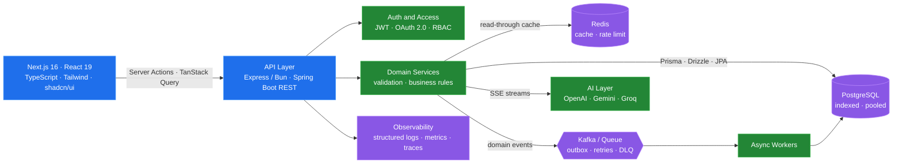
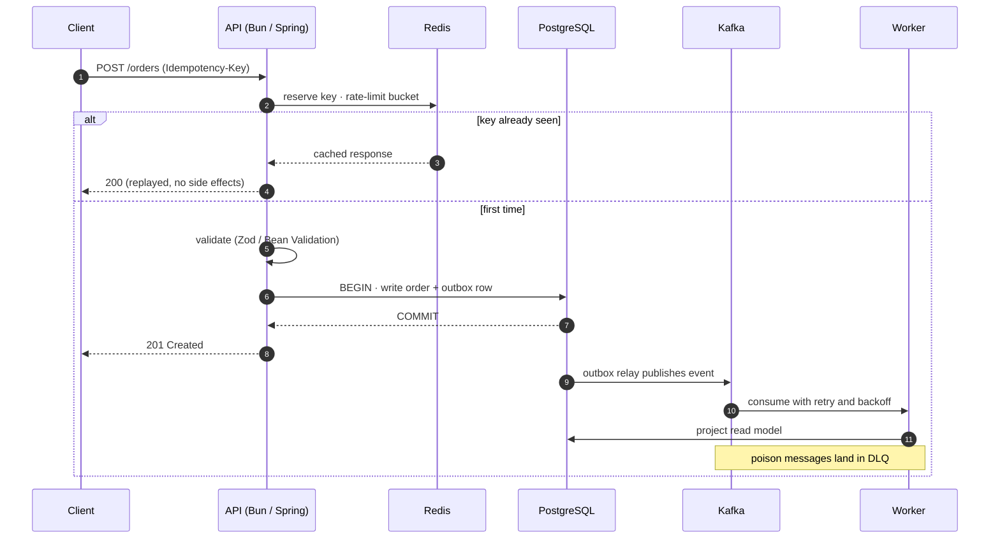
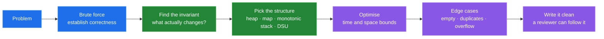

<div align="center">

# Swadesh Chatterjee

### Full-Stack Engineer

Schema to screen — I model the data, design the contract, build the service, and ship the interface that consumes it.

<a href="https://www.swadesh.cc"></a>
<a href="https://www.linkedin.com/in/swadeshchatterjee/"></a>
<a href="https://twitter.com/Swadesh072"></a>
<a href="https://leetcode.com/u/swadesh072/"></a>
<a href="mailto:swadeshchatterjee512@gmail.com"></a>


</div>

---

## 01 · About

<table>
<tr>
<td valign="top" width="52%">

```yaml
name:      Swadesh Chatterjee
role:      Full-Stack Engineer
frontend:  Next.js · React · TypeScript · Tailwind
backend:   Java · Spring Boot · Node/Bun · Express
data:      PostgreSQL · Redis · Prisma · Drizzle · JPA
strengths: API design · data modelling · DSA
location:  Bengaluru, India
email:     swadeshchatterjee512@gmail.com
```

One person, one coherent system, no handoff gaps. I care about the
parts that only show up under load — indexes, query plans, cache
invalidation, p99 — not just the happy path on localhost.

</td>
<td valign="top" width="48%">

```ts
const now = {
  building : "Flux — agentic app builder (SSE + Sandpack)",
  shipping : "Spring Boot 4 + Spring AI image pipeline",
  learning : "Kafka semantics · outbox · idempotency",
  grinding : "LeetCode — graphs and DP",
} as const;
```

- Streaming **SSE** pipelines, agentic workflows, LLM-backed services
- Fluent in **both** stacks — Spring Boot 3/4 + JPA **and** Bun/Express + TS
- Type safety across the wire — shared contracts, `Zod`, generated OpenAPI clients
- Ship features whole: migration, endpoint, UI, tests, dashboard

</td>
</tr>
</table>

---

## 02 · How I Build a Product



<details>
<summary><b>A write request, hop by hop</b></summary>

<br/>



</details>

<details>
<summary><b>The rules I hold myself to</b></summary>

<br/>

| Concern | How I handle it |
| :-- | :-- |
| **Contracts** | One source of truth for types — schema-first models, `Zod`/Bean Validation at every boundary, versioned and documented endpoints |
| **Data access** | Explicit fetch plans over lazy-loading surprises, covering indexes, `EXPLAIN ANALYZE` before shipping |
| **Correctness** | Idempotency keys on writes, transactional outbox for events, optimistic locking on contended rows |
| **Frontend** | Server components by default, client state only where it earns its place, suspense boundaries and real loading/error states |
| **Resilience** | Timeouts on every hop, retries with jitter, circuit breakers, dead-letter queues |
| **Caching** | Read-through Redis with explicit TTLs and invalidation on write — never "cache and hope" |
| **Security** | Short-lived JWTs with rotation, least-privilege tokens, parameterised queries, secrets out of the repo |
| **Testing** | Testcontainers for real Postgres/Kafka in CI, integration tests over mocks that lie |
| **Observability** | Structured logs with trace IDs, RED metrics per endpoint, alerts on p99 not p50 |

</details>

---

## 03 · Stack

<table>
<tr>
<td valign="top" width="50%">

**Frontend**

      

**Node Ecosystem**

     

**Data**

      

</td>
<td valign="top" width="50%">

**Java Backend**

       

**APIs and Auth**

       

**Platform and Tooling**

      

</td>
</tr>
</table>

---

## 04 · Selected Work

<table>
<tr>
<td width="50%" valign="top">

### [Flux](https://github.com/swadesh-231/flux)

Agentic app builder — prompt in, running app out. Streams the build
over SSE, renders a live Sandpack preview, exports source as a zip.
Credit-metered plans and role-scoped model chains across OpenAI,
Gemini and Groq.

`Next.js 16` `React 19` `Prisma` `Neon` `Clerk` `Bun`

</td>
<td width="50%" valign="top">

### [Photo AI Studio](https://github.com/swadesh-231)

Upload, preview and transform photos — background removal and
anime/avatar styles — behind a Google Photos-style library shell,
with transformation state persisted per asset.

`Spring Boot 4` `Spring AI` `JPA` `Next.js` `ImageKit`

</td>
</tr>
<tr>
<td width="50%" valign="top">

### [Loophire](https://github.com/swadesh-231)

AI interviewer and talent marketplace — resume-driven question
generation, scored transcripts, and hand-rolled JWT + OAuth + RBAC
instead of a managed auth provider.

`Bun` `TypeScript` `Express` `React`

</td>
<td width="50%" valign="top">

### [Choco Cart](https://github.com/swadesh-231)

Full e-commerce storefront with an admin panel for catalogue,
orders and inventory — typed data access throughout, auth handled
at the edge.

`Next.js` `Drizzle ORM` `Neon` `Better Auth`

</td>
</tr>
<tr>
<td width="50%" valign="top">

### [Stays](https://github.com/swadesh-231)

Airbnb-style rental marketplace — search, availability windows,
booking and payments, with overlap-safe reservation logic and bot
protection on write paths.

`Next.js 16` `Prisma` `PostgreSQL` `Arcjet`

</td>
<td width="50%" valign="top">

### [AI CSV Lead Importer](https://github.com/swadesh-231)

Two-stage profiling and batch extraction pipeline that maps
arbitrary CSV shapes onto a fixed 15-field CRM schema — profile
first, then extract in batches with validation and retries.

`LLM` `Node.js` `TypeScript`

</td>
</tr>
</table>

<details>
<summary><b>More projects</b></summary>

<br/>

| Project | What it is | Stack |
| :-- | :-- | :-- |
| **[Ledger](https://github.com/swadesh-231)** | Expense tracker with categorised analytics over a fully typed API layer | `Bun` `TypeScript` `React` |
| **[Auth Service](https://github.com/swadesh-231)** | Production-grade email-OTP auth — rate limits, expiry, replay protection | `Spring Boot` `PostgreSQL` `Redis` |
| **[DSA Pattern Tracker](https://github.com/swadesh-231)** | Tracks problems by pattern rather than by list, with spaced revision | `Next.js` `TypeScript` `Postgres` |

</details>

---

## 05 · Problem Solving

Consistent practice on **[LeetCode](https://leetcode.com/u/swadesh072/)** — arrays, graphs, dynamic
programming and system-design fundamentals. It shows up in the work: better complexity choices,
tighter data structures, fewer accidental O(n²) loops in production code.



---

<div align="center">

### Open to full-stack and product engineering roles

Next.js · TypeScript · React · Node/Express · Java · Spring Boot

<a href="https://www.swadesh.cc"></a>
<a href="https://www.linkedin.com/in/swadeshchatterjee/"></a>
<a href="mailto:swadeshchatterjee512@gmail.com"></a>

</div>
