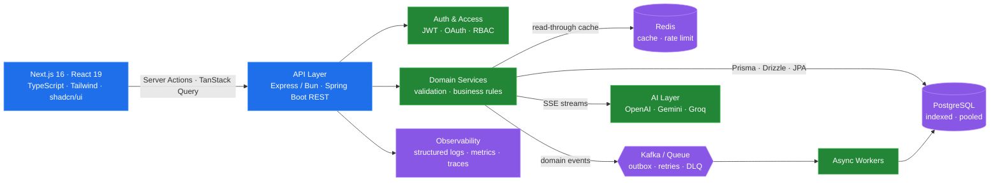

<div align="center">

<h1>
  Swadesh Chatterjee
  
</h1>

<p><b>Full-Stack Engineer</b> · Next.js &amp; TypeScript on the front, Java/Spring Boot and Node/Bun on the back</p>

<a href="https://github.com/swadesh-231">
  
</a>

<br/><br/>

<a href="https://www.swadesh.cc"></a>
<a href="https://www.linkedin.com/in/swadeshchatterjee/"></a>
<a href="https://twitter.com/Swadesh072"></a>
<a href="https://leetcode.com/u/swadesh072/"></a>
<a href="mailto:swadeshchatterjee512@gmail.com"></a>
<br/>


</div>

---

<table>
<tr>
<td valign="top" width="56%">

### About

```yaml
name:      Swadesh Chatterjee
role:      Full-Stack Engineer
frontend:  Next.js · React · TypeScript · Tailwind · shadcn/ui
backend:   Java · Spring Boot · Node/Bun · Express
data:      PostgreSQL · Redis · Prisma · Drizzle · JPA
strengths: API design · Data modelling · DSA & problem solving
location:  Bengaluru, India
email:     swadeshchatterjee512@gmail.com
```

**What I actually do:** own features end to end — model the data,
design the API contract, build the service, then ship the interface
that consumes it. One person, one coherent system, no handoff gaps.

- Building AI-driven products: streaming SSE pipelines, agentic workflows, LLM-backed services
- Comfortable in both ecosystems — **Spring Boot 3/4 + JPA** and **Bun/Express + TypeScript**
- Type safety across the wire: shared contracts, `Zod` validation, generated OpenAPI clients
- Care deeply about **indexes, query plans, caching and p99** — not just "it works locally"
- Sharpening **DSA on LeetCode**: optimal complexity, clean and readable solutions

</td>
<td valign="top" width="44%">


</td>
</tr>
</table>

---

### How I Build a Product



<details>
<summary><b>The rules I hold myself to</b></summary>

<br/>

| Concern | How I handle it |
| :-- | :-- |
| **Contracts** | One source of truth for types — schema-first models, `Zod`/Bean Validation at every boundary, versioned and documented endpoints |
| **Data access** | Explicit fetch plans over lazy-loading surprises, covering indexes, `EXPLAIN ANALYZE` before shipping |
| **Correctness** | Idempotency keys on writes, transactional outbox for events, optimistic locking on contended rows |
| **Frontend** | Server components by default, client state only where it earns its place, suspense boundaries and real loading/error states |
| **Resilience** | Timeouts on every hop, retries with jitter, circuit breakers, dead-letter queues |
| **Caching** | Read-through Redis with explicit TTLs and invalidation on write — never "cache and hope" |
| **Accessibility & UX** | Keyboard paths, focus management, semantic markup, no layout shift on data load |
| **Testing** | Testcontainers for real Postgres/Kafka in CI, integration tests over mocks that lie |
| **Observability** | Structured logs with trace IDs, RED metrics per endpoint, alerts on p99 not p50 |

</details>

---

### Stack

<table>
<tr>
<td valign="top" width="50%">

#### Frontend


`Next.js 16` `React 19` `TypeScript` `Tailwind v4`
`shadcn/ui` `TanStack Query` `Framer Motion` `Zustand`

#### Node Ecosystem


`Node.js` `Bun` `Express` `tRPC` `Zod` `Vite`

#### Data


`PostgreSQL (Neon)` `Redis` `MongoDB`
`Prisma` `Drizzle ORM` `Flyway` `JPA / Hibernate`

</td>
<td valign="top" width="50%">

#### Java Backend


`Java 21` `Spring Boot 3/4` `Spring Security` `Spring Data JPA`
`Spring AI` `MapStruct` `Resilience4j` `Maven / Gradle`

#### APIs &amp; Auth


`REST` `GraphQL` `WebSockets` `SSE` `OpenAPI`
`JWT` `OAuth 2.0` `RBAC` `Clerk` `Better Auth`

#### Platform &amp; Tooling


`Docker` `AWS` `Vercel` `GitHub Actions` `Testcontainers` `Prometheus`

</td>
</tr>
</table>

---

### Featured Work

| Project | What it is | Stack |
| :-- | :-- | :-- |
| **[Flux](https://github.com/swadesh-231/flux)** | Agentic app builder — prompt in, running app out. Streams the build over SSE, renders a live Sandpack preview, exports source as a zip. Credit-metered plans, role-scoped model chains across OpenAI/Gemini/Groq. | `Next.js 16` `React 19` `Prisma` `Neon` `Clerk` `Bun` |
| **[Photo AI Studio](https://github.com/swadesh-231)** | Upload, preview and transform photos — background removal and anime/avatar styles — behind a Google Photos-style library shell. | `Spring Boot 4` `Spring AI` `JPA` `Next.js` `ImageKit` |
| **[Loophire](https://github.com/swadesh-231)** | AI interviewer and talent marketplace — resume-driven question generation, hand-rolled JWT + OAuth + RBAC instead of a managed provider. | `Bun` `TypeScript` `Express` `React` |
| **[Choco Cart](https://github.com/swadesh-231)** | Full e-commerce storefront with an admin panel for catalogue, orders and inventory. | `Next.js` `Drizzle ORM` `Neon` `Better Auth` |
| **[Stays](https://github.com/swadesh-231)** | Airbnb-style rental marketplace — search, availability, booking and payments. | `Next.js 16` `Prisma` `Postgres` `Arcjet` |
| **[AI CSV Lead Importer](https://github.com/swadesh-231)** | Two-stage profiling and batch extraction pipeline mapping arbitrary CSVs onto a fixed 15-field CRM schema. | `LLM` `Node` `TypeScript` |
| **[Ledger](https://github.com/swadesh-231)** | Expense tracker with categorised analytics over a fully typed API layer. | `Bun` `TypeScript` `React` |

> Replace the placeholder links with the real repo URLs — the table structure is ready.

---

### Problem Solving

Consistent practice on **[LeetCode](https://leetcode.com/u/swadesh072/)** — arrays, graphs, dynamic
programming and system-design fundamentals. The habit shows up in the work: better complexity
choices, tighter data structures, and fewer accidental O(n²) loops in production code.

<p align="center">
  
</p>

---

### GitHub Metrics

<p align="center">
  
  
</p>

<p align="center">
  
  
</p>

<p align="center">
  
</p>

---

<div align="center">

### Open to full-stack &amp; product engineering roles

**Next.js · TypeScript · React · Node/Express · Java · Spring Boot**

<a href="https://www.swadesh.cc"></a>&nbsp;
<a href="https://www.linkedin.com/in/swadeshchatterjee/"></a>&nbsp;
<a href="mailto:swadeshchatterjee512@gmail.com"></a>

<br/><br/>

<i>From <a href="https://github.com/swadesh-231">swadesh-231</a> — thanks for stopping by.</i>

</div>
