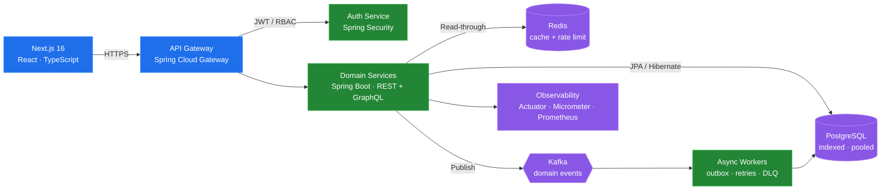

<!--
  README.md — Swadesh Chatterjee
  Backend Engineer · Java & Spring Boot · Distributed Systems
  ──────────────────────────────────────────────────────────
  Notes:
   - GitHub Stats / Top Languages use `github-profile-summary-cards`
     (separate Vercel deployment) because the public
     github-readme-stats instance has been rate-limited 2025–2026.
   - Streak Stats use streak-stats.demolab.com (Heroku version deprecated).
   - The Mermaid block below renders natively on GitHub — no external service.
   - Replace the repo links in "Featured Work" with your real repos.
-->

<div align="center">

<h1>
  Hi, I'm Swadesh Chatterjee
  
</h1>

<a href="https://github.com/swadesh-231">
  
</a>

<br/><br/>

<a href="https://www.linkedin.com/in/swadeshchatterjee/"></a>
<a href="https://twitter.com/Swadesh072"></a>
<a href="https://leetcode.com/u/swadesh072/"></a>
<a href="mailto:swadeshchatterjee512@gmail.com"></a>
<br/>


</div>

---

<table>
<tr>
<td valign="top" width="56%">

### 🧭 About

```yaml
name:      Swadesh Chatterjee
role:      Backend Engineer
primary:   Java · Spring Boot · PostgreSQL · Kafka
secondary: TypeScript · Next.js · React · Node/Bun
domains:   Distributed Systems · Microservices · API Design
location:  Bengaluru, India 🇮🇳
email:     swadeshchatterjee512@gmail.com
```

**What I actually do:** design and ship backend services that stay
correct under concurrency and fast under load — clean domain
boundaries, well-indexed schemas, idempotent APIs, and
observability baked in from day one.

- 🔭 Building **event-driven microservices** on Spring Boot + Kafka
- 🧱 Deep in **JVM concurrency**, **JPA/Hibernate internals**, and **query planning**
- ⚡ Chasing **sub-100 ms p99** through caching, connection pooling, and N+1 elimination
- 🎯 Ship full-stack when the product needs it — **Next.js 16 + TypeScript** front ends
- 🧠 Sharpening DSA on **LeetCode**: optimal complexity, readable code

</td>
<td valign="top" width="44%">


</td>
</tr>
</table>

---

### 🏗️ How I Architect a Service



<details>
<summary><b>The rules I hold myself to</b></summary>

<br/>

| Concern | How I handle it |
| :-- | :-- |
| **Correctness** | Idempotency keys on writes, transactional outbox for event publishing, optimistic locking on contended rows |
| **Data access** | Explicit fetch plans over lazy-loading surprises; covering indexes; `EXPLAIN ANALYZE` before shipping |
| **Concurrency** | Virtual threads / bounded pools over unbounded async; no shared mutable state across requests |
| **Resilience** | Timeouts on every hop, circuit breakers, exponential backoff with jitter, dead-letter queues |
| **Caching** | Read-through Redis with explicit TTLs and invalidation on write — never "cache and hope" |
| **API design** | Versioned contracts, cursor pagination, RFC 7807 problem details, OpenAPI generated from code |
| **Testing** | Testcontainers for real Postgres/Kafka in CI — no in-memory H2 lies |
| **Observability** | Structured logs with trace IDs, RED metrics per endpoint, alerts on p99 not p50 |

</details>

---

### 🛠️ Stack

<table>
<tr>
<td valign="top" width="50%">

#### ☕ Core Backend


`Java 21` `Spring Boot 3` `Spring Security` `Spring Data JPA`
`Hibernate` `Spring Cloud Gateway` `Resilience4j` `Maven / Gradle`

#### 🔌 APIs & Messaging


`REST` `GraphQL` `gRPC` `WebSockets` `Kafka` `RabbitMQ` `OpenAPI`

#### 🗄️ Data


`PostgreSQL` `Redis` `MongoDB` `Flyway` `Prisma` `Drizzle ORM`

</td>
<td valign="top" width="50%">

#### 🌐 Frontend (when needed)


`Next.js 16` `React 19` `TypeScript` `Tailwind v4` `shadcn/ui` `TanStack Query`

#### 🟩 Node Ecosystem


`Node.js` `Bun` `Express` `Zod` `tRPC`

#### ☁️ Platform & Tooling


`Docker` `Kubernetes` `AWS` `GitHub Actions` `Prometheus` `Grafana` `Testcontainers`

</td>
</tr>
</table>

---

### 🚀 Featured Work

| Project | What it is | Stack |
| :-- | :-- | :-- |
| **[Loophire](https://github.com/swadesh-231)** | AI interviewer & talent marketplace — resume-driven question generation, hand-rolled JWT + OAuth + RBAC | `Bun` `TypeScript` `Express` `React` |
| **[AI CSV Lead Importer](https://github.com/swadesh-231)** | Two-stage profiling + batch extraction pipeline mapping arbitrary CSVs onto a fixed 15-field CRM schema | `LLM` `Node` `TypeScript` |
| **[Stays](https://github.com/swadesh-231)** | Airbnb-style rental marketplace with search, booking and payments | `Next.js 16` `Prisma` `Postgres` `Better Auth` |
| **[Ledger](https://github.com/swadesh-231)** | Expense tracker with categorized analytics and a typed API layer | `Bun` `TypeScript` `React` |
| **[Job Application Agent](https://github.com/swadesh-231)** | Agentic workflow that tailors and submits applications end to end | `TypeScript` `LLM` |

> Swap these links for the real repo URLs — the table structure is ready.

---

### 📊 GitHub Metrics

<p align="center">
  
  
</p>

<p align="center">
  
  
</p>

<p align="center">
  
</p>

<p align="center">
  
</p>

---

<div align="center">

### 🤝 Open to backend & platform engineering roles

**Java · Spring Boot · Distributed Systems**

<a href="https://www.linkedin.com/in/swadeshchatterjee/"></a>&nbsp;
<a href="mailto:swadeshchatterjee512@gmail.com"></a>

<br/><br/>

<i>⭐ From <a href="https://github.com/swadesh-231">swadesh-231</a> — thanks for stopping by.</i>

</div>
